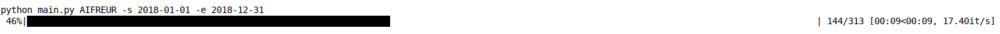

# Dukascopy data downloader 

Finding good Forex data is difficult or expensive. Dukascopy has made available an excellent [web tool](https://www.dukascopy.com/swiss/english/marketwatch/historical/) to download tick data for a large a variety of 
Forex, CFD and commodities. This is awesome and extremely useful for people, like us, trying to study the Finance market. 
  However, it takes a lot of time to download a large data set from the website because you can download only one day per time. Some open code exist to make it automatic like duka or dukascopy node on GitHub. However, this code are not optimized and or do not work anymore.

In order to solve this issue we implemented our own downloader. The most helpful resource that we used was the duka GitHub repository.  

The result is a small terminal application (it can also be used through its app function) that can be used to download ticks for a given date range from the Dukascopy historical data feed for one or more symbols. It takes advantage of multiple threads in order to speed up the download. Moreover, it uses in our knowledge the best api of Dukascopy to download in bulk, that is the daily download and not the hourly like most other code do. Improved, it now takes roughly 20s to download tick data for one year for a given french instrument (csv size: 200mb). Not bad :)

Moreover, it save the data in a parquet compressed file instead of a csv like other solution we found.

Key features :
 - Ticks data ask/bid and associated volumes
 - Parquet lz4 compression output
 - Multi-thread support
 - All Dukascopy historical tick data

This is what **duka** looks like:



As you can see, it estimates the time left until the download is completed. This is extremely useful when downloading a large data set. 


I hope you enjoy it!! 


## Usage
```
 usage: main.py [options]

 positional arguments:
    SYMBOLS               symbol list using format EURUSD EURGBP 

 optional arguments:
     -h           show help message and exit 
     -d DAY       specific day format YYYY-MM-DD (default today)
     -s STARTDATE start date format YYYY-MM-DD (default today)
     -e ENDDATE   end date format YYYY-MM-DD (default today)
     -f FOLDER    the dowloaded data will be saved in FOLDER (default '.')
     -t THREAD    number of threads (default 20)
```

## Examples


- Help

   ```
   python main.py -h
   ```
- Download last available tick set (i.e. yesterday if not Saturday ) for `EURUSD` and `GBPUSD` 

  ```
  python main.py EURUSD GBPUSD 
  ```
- Download ticks for the `EURUSD` for a specific day

  ``` 
  python main.py duka EURUSD -d 2016-02-02
  ```
- Download ticks for the `EURUSD` between two dates. For example:

  ```
  python main.py EURUSD -s 2015-01-01 -e 2016-12-31 
  ```
  download all ticks for the 2015 year

- We can specify only the start date. The default end date will be today. For example:   
  
  ```
  python main.py EURUSD -s 2016-01-01
  ```
  downloads all ticks from the beginning of the year until now. 

All data is saved in the current folder. You can also specify the number of threads to be used by setting the `t` option. 
I recommend not to use too many threads because you might encounter problems opening too many connection to the server. 
 
Best number of concurrent requests (threads) is 20-30 one day tick data. After this the server is too busy and respond in error, even with different ticker. One could try to different computer in parallel.

## License

This software is licensed under the MIT License.

Copyright Giuseppe Pes, 2016.

Permission is hereby granted, free of charge, to any person obtaining a
copy of this software and associated documentation files (the
"Software"), to deal in the Software without restriction, including
without limitation the rights to use, copy, modify, merge, publish,
distribute, sublicense, and/or sell copies of the Software, and to permit
persons to whom the Software is furnished to do so, subject to the
following conditions:

The above copyright notice and this permission notice shall be included
in all copies or substantial portions of the Software.

THE SOFTWARE IS PROVIDED "AS IS", WITHOUT WARRANTY OF ANY KIND, EXPRESS
OR IMPLIED, INCLUDING BUT NOT LIMITED TO THE WARRANTIES OF
MERCHANTABILITY, FITNESS FOR A PARTICULAR PURPOSE AND NONINFRINGEMENT. IN
NO EVENT SHALL THE AUTHORS OR COPYRIGHT HOLDERS BE LIABLE FOR ANY CLAIM,
DAMAGES OR OTHER LIABILITY, WHETHER IN AN ACTION OF CONTRACT, TORT OR
OTHERWISE, ARISING FROM, OUT OF OR IN CONNECTION WITH THE SOFTWARE OR THE
USE OR OTHER DEALINGS IN THE SOFTWARE.


